# CarPrice-Predictor

    Here , i am gonna build a linear model using a raw uncleaned real world data to predict the price of the used car
    NOTE : Q: why this is different then other's thousands of car price prediction proeject ?

    Ans : Here i am gonna , check for :

    a) Heteroscedasticity

    b) test linear regression against regularized versions (Ridge/Lasso/ElasticNet)

    c) I am going to explain why regularization helped me or didn't in this project.

    d) Probably, i am gonna try to engineered such feature that could measureably improved the model .

# Features - I need and i don't need

### 🛑 The Absolute Unwanted (Drop Immediately)

* **`VIN` (Vehicle Identification Number)**
  * **Why:** This is a completely unique identifier for every single car (like a fingerprint or social security number). It has high cardinality (nearly every row will have a unique value), meaning a machine learning model can't learn any general trends from it. It's 100% noise for price prediction.

### ⚠️ The Redundant / Noise Columns (Highly Recommended to Drop)

* **`region` and `state`**
  * **Why:** While geographic location *can* slightly affect car prices (e.g., 4WDs sell better in snowy states), having both is highly redundant. `region` usually contains hundreds of specific local areas, which creates too many categories (high cardinality) and overcomplicates your model.
  * **Recommendation:** Drop `region` entirely. If you want to keep geographical context, keep only `state`, or drop both if you want a generalized country-wide model.

### 🔍 The "Proceed with Caution" Columns (Keep, but clean up)

* **`model`**
  * **Why it's tricky:** Car models (e.g., "Camry", "Mustang", "F-150") are *incredibly* important for price. However, this column usually contains thousands of messy, misspelled, or overly specific text entries (e.g., "Civic EX-L", "Civic LX").
  * **Recommendation:** Don't drop it immediately, but it will require heavy text cleaning or target encoding. If it's too messy and your model is overfitting, you might rely purely on `manufacturer` and `type`.
* **`paint_color`**
  * **Why it's borderline:** Unless a car is a wildly unpopular color, a white Camry and a silver Camry generally cost the same. It has very low predictive power and mostly adds unnecessary complexity.
  * **Recommendation:** Safe to drop if you want a leaner model, or group rare colors into an "Other" category.

### The Gold Standard (Definitely Keep)

For context, these are your heavy hitters that you **must** keep for an accurate price prediction:

* **`year` and `odometer`:** The ultimate indicators of age and wear.
* **`manufacturer`, `cylinders`, `fuel`, `transmission`, `type`:** These define the core mechanics and class of the vehicle.
* **`condition` and `title_status`:** Critical for identifying depreciated assets (like a "salvage" title or a car listed in "fair" condition).

## About Feature [title_status]

The **title status** tells the legal/history condition of the vehicle.

Here’s what each means:

---

# 1. `clean`

A normal vehicle title.

Meaning:

* No major legal or insurance issues recorded.
* Car was not declared total loss.

This is usually the most desirable condition.

---

# 2. `rebuilt`

The car was previously damaged badly and declared a total loss (`salvage`), but later repaired and inspected for road use.

Meaning:

* Car had serious damage before.
* Someone repaired it.
* Now legally drivable again.

Usually cheaper than clean-title cars.

---

# 3. `lien`

There is still a loan/legal financial claim on the car.

Meaning:

* Owner may still owe money to a bank/lender.
* Transfer/sale can have legal complications.

---

# 4. `salvage`

The vehicle was heavily damaged and declared a total loss by insurance.

Possible causes:

* accident,
* flood,
* fire,
* severe damage.

Usually:

* unsafe or expensive to repair,
* very low resale value.

Important feature for price prediction.

---

# 5. `missing`

Title information is unavailable or unknown.

Could mean:

* missing data,
* undocumented history.

You may treat this carefully during preprocessing.

---

# 6. `parts only`

Vehicle is not intended for road use anymore.

Meaning:

* sold only for spare parts,
* usually non-functional or irreparable.

These cars often have extremely low prices.

# **TEXT PREPROCESSING :**

### Step 1: Clean the Strings (Standardization)

Before encoding, reduce the sheer number of unique values by cleaning up the typos and variations. If `F-150`, `f150`, and `f-150 ` are treated as different things, cleaning them solves half your problem.

### Step 2: Group the "Rare" Models (Frequency Thresholding)

Look at your output: thousands of models only appear **1 time** (like `gand wagoneer`). A machine learning model cannot learn a price pattern from a car it only sees once.

Group all models that appear less than a certain threshold (e.g., less than 10 or 20 times) into a catch-all category called `'other'`. This will instantly plummet your unique count from 12,000+ to a few hundred.

## Target Encoding

#### 1) df['model'] :

To understand why Target Encoding is best, look at why the alternatives fall short for this specific column:

#### 1. One-Hot Encoding (Bad Choice)

* **What it does:** Creates a separate column for every single unique car model (1 or 0).
* **Why it fails here:** Even after cleaning, you likely have hundreds of unique car models left. Creating 500+ new columns creates a massive, sparse matrix that consumes excessive memory, slows down training, and triggers the "curse of dimensionality," severely harming model performance.

#### 2. Label Encoding / Ordinal Encoding (Bad Choice)

* **What it does:** Assigns a random arbitrary integer to each model (e.g., `camry = 1`, `f150 = 2`, `accord = 3`).
* **Why it fails here:** Algorithms naturally assume that numbers have a sequence or order (i.e., **3**>**2**>**1**). Label encoding forces your model to assume that an Accord is mathematically "greater than" a Camry and twice as large as a F-150, which makes no sense and misleads the machine learning algorithm.

### ⚠️ One Critical Rule: Prevent Target Leakage!

Because Target Encoding uses the `price` (the dependent variable) to calculate the encoded values, you must compute the encoding **only on your Training Split** and then map those calculated values onto your Test Split.

If you encode the entire dataset before splitting, your model will subtly "cheat" by looking at the test set prices during training, leading to overly optimistic training scores but terrible performance on real-world data. The `category_encoders` library handles this smoothly when you use `.fit_transform()` on training data and `.transform()` on testing data.

### 2) df['Manucfacturer']

##### Extract only the numbers from the text (e.g., "6 cylinders" -> 6)

    code: 	df['cylinders'] = df['cylinders'].str.extract(r'(\d+)').astype(float)

Explanation  :

a) r = this represent raw strings

b) \d = represents any digit from 0 to 9

c) +  = represent one or more . For eg : if given 10 or 12 cylinders then it will extract both 10 and 12 not just beginning one only

d)astype(float) :

Even though the text `"6 cylinders"` has been cut down to `"6"`, Python still thinks it is a text string (like a word), not a number. You cannot calculate averages or correlations with text.

* `.astype(float)` converts that text string `"6"` into an actual decimal number: `6.0`.

## **Important note : [during OneHotEncoding]**

💡 Why `index=X_train.index` is critical

When Scikit-Learn outputs `fit_transform()`, it completely strips away your Pandas index and returns a raw, unindexed NumPy array starting back at row `0`. If your `X_train` rows have been shuffled or split, missing the `index=X_train.index` step will cause the rows to misalign when you run `pd.concat()`, filling your dataset with broken `NaN` values!

## **NOTE : Implementation of Column transformer to reduce code**

💡 Why this is much better

1. **Massive Code Reduction:** Your manual code requires about 10 lines of matrix manipulation per column. If you added `'type'` and `'transmission'` manually, you would have written nearly 30 lines of error-prone code. The `ColumnTransformer` handles all of them simultaneously.
2. **`remainder='passthrough'` is the Secret Sauce:** Without this parameter, `ColumnTransformer` would drop any column you didn't explicitly encode. Adding `remainder='passthrough'` tells it to process the categorical columns and leave your numeric columns (like `year` or `odometer`) completely alone, gluing everything back together automatically.

## **When to drop column or impute (missing % per column)**

| Missing Percentage | Typical Action                      |
| ------------------ | ----------------------------------- |
| 0–5%              | Usually safe to impute              |
| 5–20%             | Impute carefully after analysis     |
| 20–40%            | Depends on feature importance       |
| 40–60%            | Usually drop unless highly valuable |
| >60–70%           | Mostly drop                         |
| >85–90%           | Almost always drop                  |

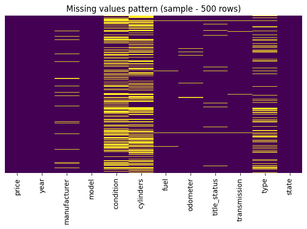

* **`condition` and `cylinders` have the highest missing values**

  These columns may require careful imputation or possible removal if they do not contribute much to model performance.
* **Columns like `price`, `year`, `model`, and `state` are almost fully complete**

  This is good because these are likely important core features for used car price prediction.
* **Missing values are not uniformly distributed across rows**

  This suggests the missingness may not be completely random, meaning certain types of car listings may systematically lack information.
* **`type`, `title_status`, and `odometer` contain moderate missing values**

  Since these are business-important features, they are probably worth imputing instead of dropping.
* **Some rows contain multiple missing columns simultaneously**

  This may indicate lower-quality listings or incomplete seller entries, which could potentially affect model reliability.

## **My View :**

#NOTE: here we see , columns like ['conditions', 'cylinders'] contains too many almost 60%

missing values but i am not gonna drop those sine they contribute a lot to my model that i

am going to train.

and columns like ['manufacturer','type','title_status', 'fuel'] etc. contains less missing

values that we will look later. For now, (global)- data cleaning it is preety fine.

# **Changes need to be done over 'price', 'year' and 'odometer'**

**The rule to remember for every future project:**

Log transform is for columns where values span multiple orders of magnitude (100 to 100,000). `price` and `odometer` qualify. `year` spans 1990–2024 — that's not magnitude difference, that's a timeline. Always engineer timeline columns into age/duration instead.

**`price` — Remove outliers first, THEN log transform**

Don't log transform before removing outliers. A $1 listing or $999,999 listing will still be a $1 and $999,999 after log transform — just slightly smaller numbers, still destroying your regression. Order matters:

```python
# Step 1: Remove junk listings first
df = df[(df['price']>=500)&(df['price']<=150000)]

# Step 2: THEN log transform
import numpy as np
df['log_price']= np.log1p(df['price'])

# Use log_price as your target (y), not price
```

---

**`odometer` — Cap outliers, THEN log transform**

Same logic — remove the 0-mile and 500,000-mile nonsense entries first, then transform. Don't remove, just cap (a 250k mile car is real, a 999,999 mile car is a typo):

```python
# Step 1: Cap extremes
df = df[(df['odometer']>=1000)&(df['odometer']<=300000)]

# Step 2: Log transform as a FEATURE (not target)
df['log_odometer']= np.log1p(df['odometer'])

# Drop original odometer column after this
df.drop(columns=['odometer'], inplace=True)
```

---

**`year` — Do NOT log transform. Engineer it instead.**

`year` is not skewed in a way that log transformation fixes — it's a calendar number, not a magnitude. Log transforming `year` makes zero mathematical sense (log(2015) means nothing). What you actually want is the  **age of the car** , which has a direct, interpretable relationship with price:

```python
# Convert year to car_age — this is linearly related to price
df['car_age']=2024- df['year']

# Remove impossible values (cars from the future or ancient history)
df = df[(df['car_age']>=0)&(df['car_age']<=30)]

# Drop original year column
df.drop(columns=['year'], inplace=True)
```

NOTE: this is before applying log transformation

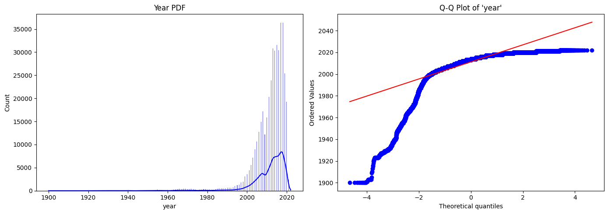

this is after applying log transformation

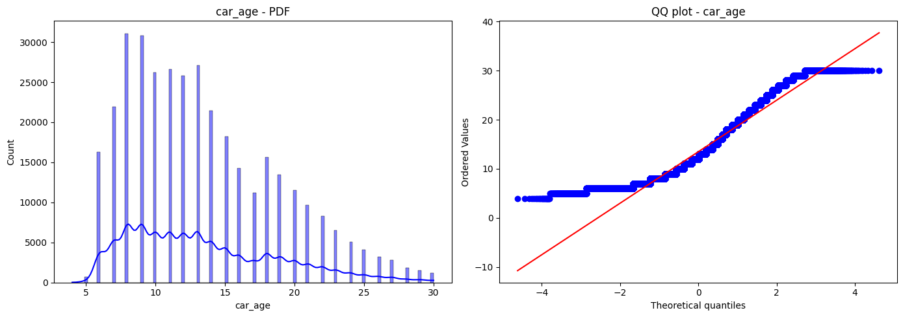

##### **Price and car_age - presence of outliers**

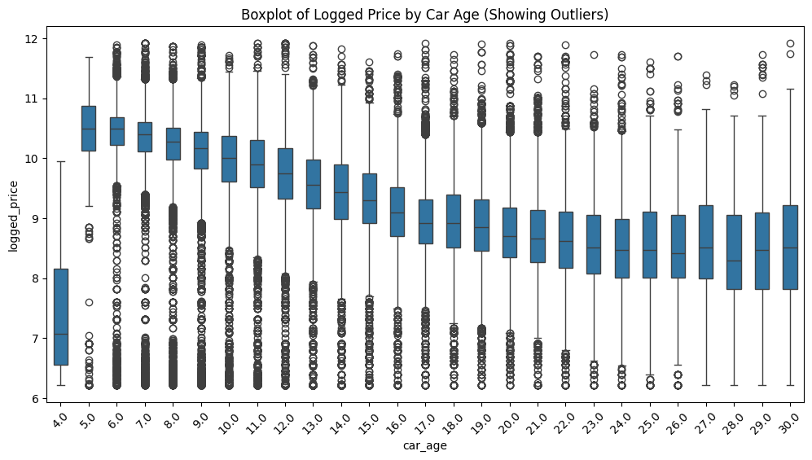

The overall trend is perfect — as `car_age` increases, `logged_price` decreases. That's exactly the relationship your model needs to learn. Your log transform worked correctly.

### **Categorical Column Distribution : checking balances of rows**

In data science, if a single category fills up 90% or 95% of an entire column, that column has almost zero variance. For your Linear Regression model, a column like that is practically useless because it doesn't offer enough variety to help predict the `price`.

We got this barcharts of each categorical feature's top 20 category and with conclusion : dominating or balanced

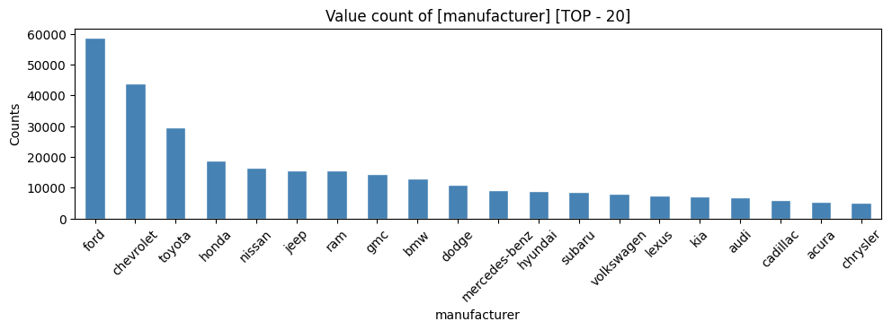

## manufacturer: top category = 17.0%  ✓ balanced enough

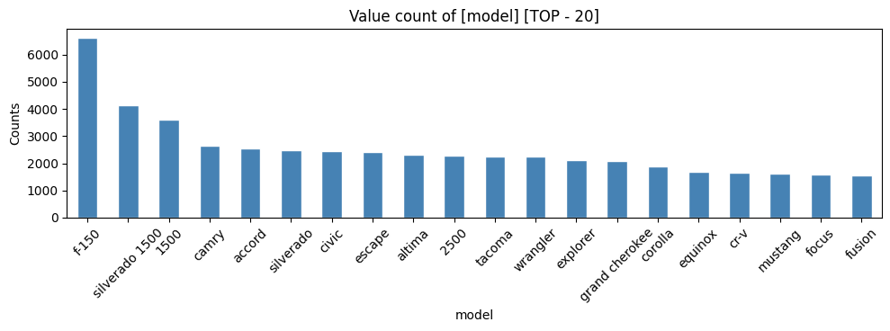

## model: top category = 1.9%  ✓ balanced enough

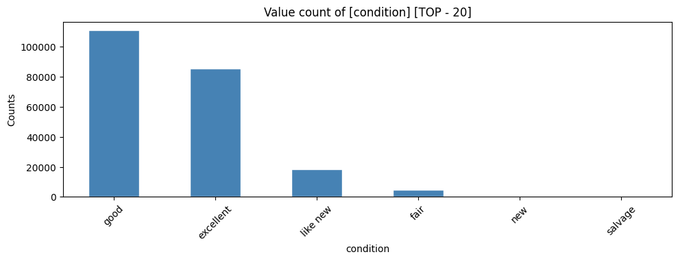

## condition: top category = 50.3%  ✓ balanced enough

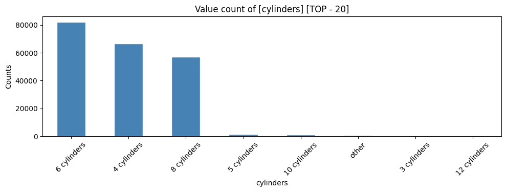

## cylinders: top category = 39.1%  ✓ balanced enough

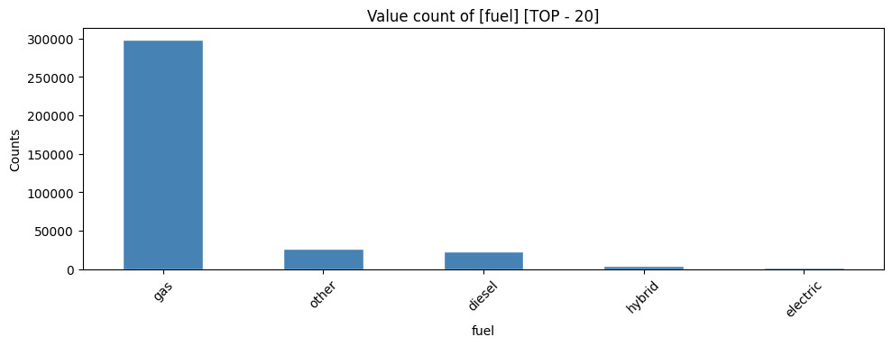

## fuel: top category = 84.1%  ✓ balanced enough

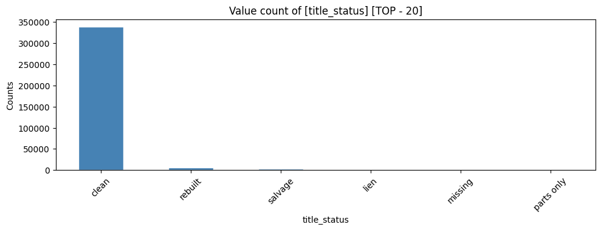

## title_status: top category = 96.6%  Dominating

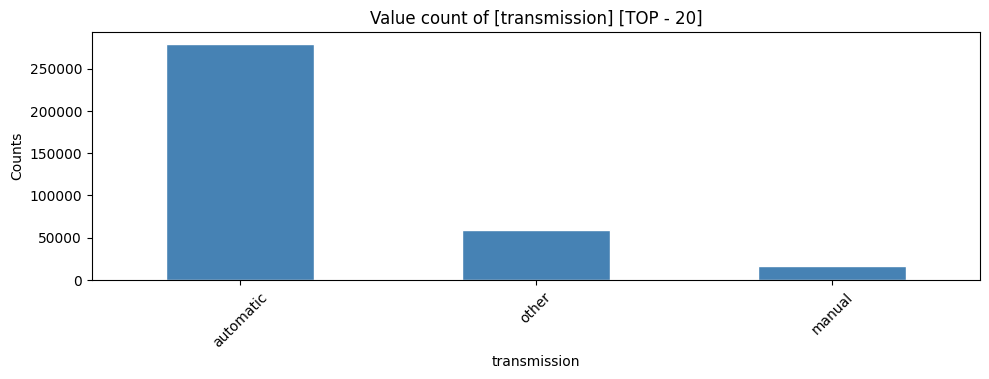

## transmission: top category = 78.7%  ✓ balanced enough

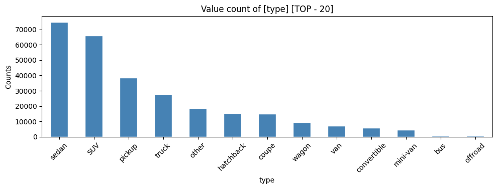

## type: top category = 26.4%  ✓ balanced enough

# Code snippet i used to check dominance

print("=== Dominance Check ===")
for col in df.select_dtypes(include='object').columns:
    top_pct = df[col].value_counts(normalize=True).iloc[0] * 100
    if top_pct >= 70:  # flag anything above 90% for review
        print(f"  {col}: top category = {top_pct:.1f}%  ← check this")		#NOTE: top_pct = top percentage
    else:
        print(f"  {col}: top category = {top_pct:.1f}%  ✓ balanced enough")

### **Function of iloc[0] = selecting the top proportion category from the list**

```
automatic    0.85
manual       0.12
other        0.03
Name: transmission, dtype: float64
```

Now, look at how the rest of the code processes this output step-by-step:

1. **Without `.iloc[0]`:** If you didn't use it, your code would try to multiply the *entire list* by 100 (`85.0%`, `12.0%`, `3.0%`). The `if` statement would crash because it can't compare a whole list of numbers against `90`.
2. **With `.iloc[0]`:** It isolates that top row value (`0.85`).
3. **The Multiplier (`* 100`):** It multiplies `0.85 * 100` to get `85.0`.

# **Handling missing values :**

since , we found that the shape of the distribution of data of categorical columns which has less than 5% of data missing ['manufacturer', 'fuel', 'transmission'] has same shape even after peforming CCA[complete case analysis] so we can conclude that the missing data are completely at **Random . Therefore we , can directly perform CCA and no need to impute.**

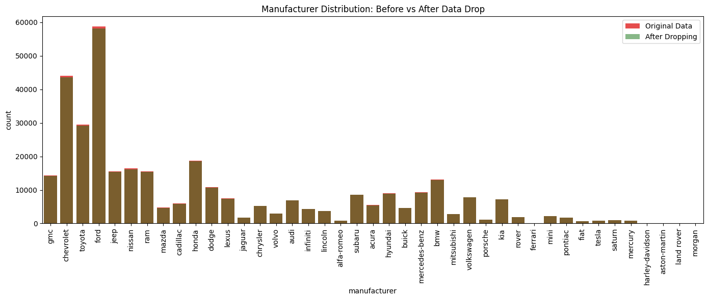a
